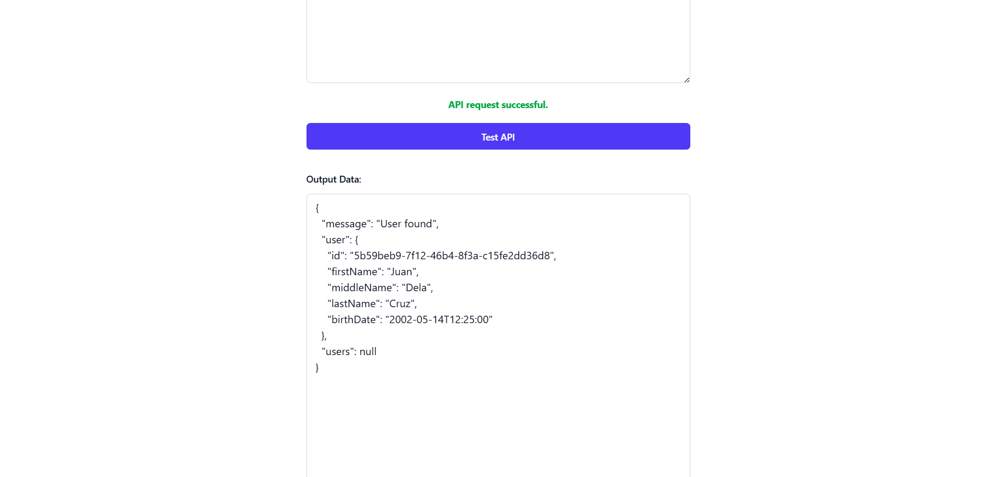

## Preview


## After cloning this repository:
1. Update the `appsettings.Development.json` depending on your frontend origin *(The `"Cors": { "AllowedOrigins": [] }` part)*.
2. Run this if you haven't installed it before:
    ```cmd
    dotnet tool install --global dotnet-ef --version 8.0.0
    ```
    *NOTE: Latest version is unstable with the current setup so I use 8.0.0*
3. Run the following CMD comamnds:
    ```
    dotnet ef migrations add InitialCreate
    dotnet ef database update
    ```
4. Run `dotnet clean` to clean unnecessary things.
5. Run `dotnet watch run` to run your backend.

---

## Prerequisites:
- DotNet
- MS SQL Server

---

## Dependencies & Configuration
The following is a list of installed dependencies and configuration settings used in this project.
You don’t need to install anything manually, as all dependencies are already managed through `project-name.csproj`.
This section is provided for reference only, to give you insight into how the project was set up.

## Dependencies:
*(Note: Some dependencies are intentionally using old versions for stable releases)*
- `dotnet add package Microsoft.EntityFrameworkCore --version 8.0.0`
- `dotnet add package Microsoft.EntityFrameworkCore.SqlServer --version 8.0.0`
- `dotnet add package Microsoft.EntityFrameworkCore.Tools --version 8.0.0`